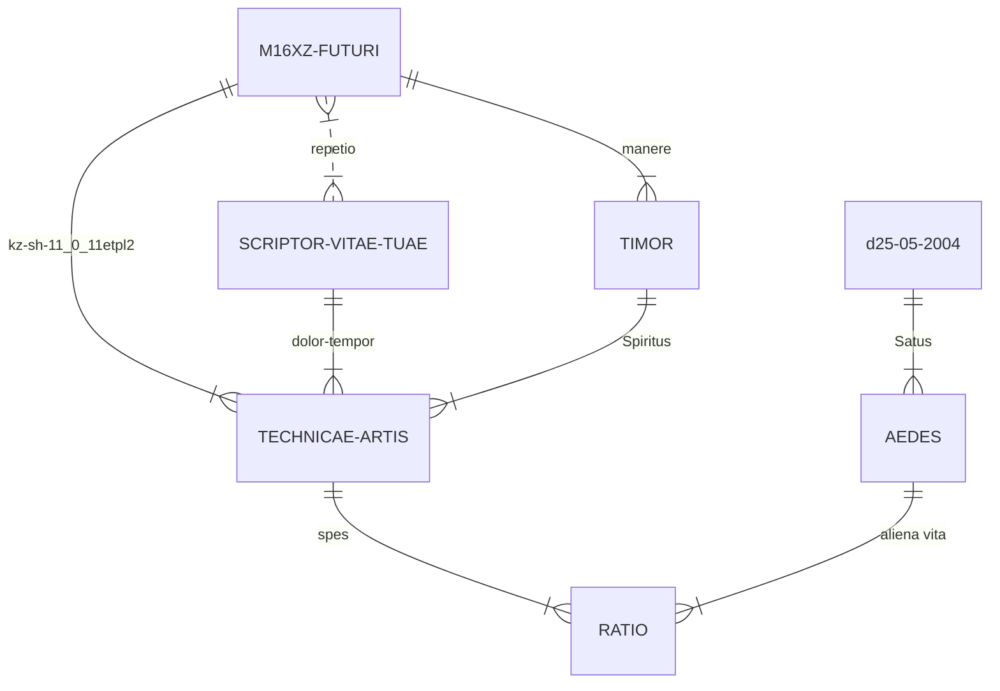

  

  

 
  
<h2>m13zm.dat</h2>

  

    
  

  

  

    
  

    
  
  
  

  

```mermaid
erDiagram
    M16XZ-FUTURI }|..|{ SCRIPTOR-VITAE-TUAE : repetio
    M16XZ-FUTURI ||--|{ TECHNICAE-ARTIS : kz-sh-11_0_11etpl2
    M16XZ-FUTURI ||--|{ TIMOR : "manere"
    SCRIPTOR-VITAE-TUAE ||--|{ TECHNICAE-ARTIS : dolor-tempor
    TIMOR ||--|{ TECHNICAE-ARTIS : Spiritus
    TECHNICAE-ARTIS ||--|{ RATIO : spes
    d25-05-2004 ||--|{ AEDES : Satus
    AEDES ||--|{ RATIO : "aliena vita"
```

---

